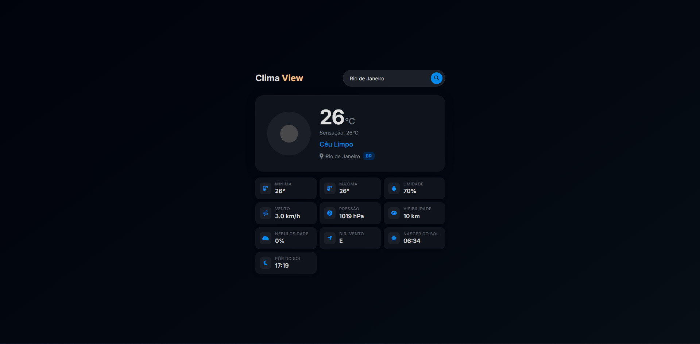

<h1 align="center">Clima Viewer</h1>

<p align="center">
  Aplicacao web responsiva para consulta em tempo real das condicoes climaticas de qualquer cidade.
</p>

<p align="center">
  <a href="#recursos">Recursos</a>&nbsp;&nbsp;&nbsp;|&nbsp;&nbsp;&nbsp;
  <a href="#tecnologias">Tecnologias</a>&nbsp;&nbsp;&nbsp;|&nbsp;&nbsp;&nbsp;
  <a href="#como-usar">Como usar</a>&nbsp;&nbsp;&nbsp;|&nbsp;&nbsp;&nbsp;
  <a href="#api">API</a>&nbsp;&nbsp;&nbsp;|&nbsp;&nbsp;&nbsp;
  <a href="#estrutura">Estrutura</a>
</p>

<br>

<p align="center">
  
</p>

## Recursos

- Busca por nome de cidade com resposta instantanea
- Exibe temperatura atual, sensacao termica, minima e maxima
- Umidade, velocidade e direcao do vento, pressao e visibilidade
- Nebulosidade e horarios de nascer/por do sol
- Tema adaptativo dia/noite baseado no periodo local da cidade
- Design responsivo para mobile e desktop
- Estados de carregamento (skeleton), erro e vazio
- Contraste WCAG AA garantido em ambos os temas

## Tecnologias

| Camada | Tecnologia |
|--------|-----------|
| Frontend | HTML5, CSS3 (OKLCH), JavaScript |
| Backend | Node.js, Express |
| API | OpenWeatherMap (Current Weather) |
| Ambiente | Vercel |

## Como usar

### Local (Node.js)

```bash
# clonar o repositorio
git clone https://github.com/seu-usuario/clima-viewer.git
cd clima-viewer

# instalar dependencias
npm install

# configurar variaveis de ambiente
cp .env.example .env
# edite .env e adicione sua chave da OpenWeatherMap

# iniciar servidor
npm start
```

Acesse `http://localhost:3000` no navegador.

## API

### GET /api/weather?city={nome da cidade}

Retorna os dados climaticos atuais para a cidade informada.

**Parametros:**

| Parametro | Tipo | Descricao |
|-----------|------|-----------|
| `city` | `string` | Nome da cidade (obrigatorio) |

**Resposta (200):**

```json
{
  "name": "London",
  "sys": { "country": "GB" },
  "main": {
    "temp": 15.2,
    "feels_like": 14.1,
    "temp_min": 13.8,
    "temp_max": 16.5,
    "humidity": 72,
    "pressure": 1015
  },
  "wind": { "speed": 4.2, "deg": 210 },
  "visibility": 10000,
  "clouds": { "all": 40 },
  "weather": [{ "icon": "04d", "description": "nublado" }],
  "timezone": 0,
  "sys": { "sunrise": 1712568000, "sunset": 1712616000 }
}
```

**Erro (404):**

```json
{ "error": "Cidade nao encontrada" }
```

## Estrutura

```
clima-viewer/
├── public/
│   ├── index.html
│   ├── scripts/
│   │   └── script.js
│   └── style/
│       └── style.css
├── images/
│   └── clima-viewer.png
├── server.mjs
├── package.json
├── .env.example
└── README.md
```
